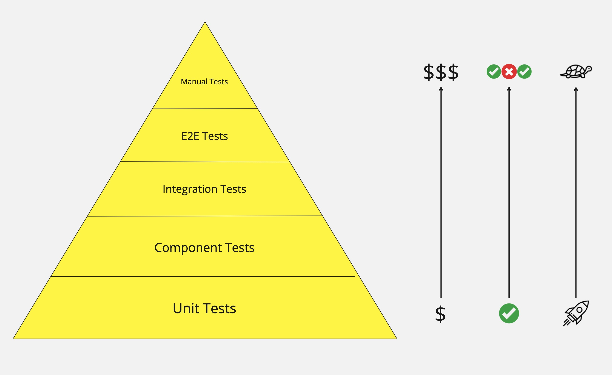

# Testing #

### Summary ###

- Unit Tests; test the smallest single unit of code/logic in isolation.
- Component Tests; a grouping of units of code/logic tested as a whole.
- [Integration Tests](Integration%20Tests/Summary.md); components of the software are
gradually integrated and then tested as a unified group.
- End To End (E2E) Tests; test an application from start to finish by simulating real 
scenarios to replicate production behaviour.
- Manual Tests; test an application manually without the help of automation tools.